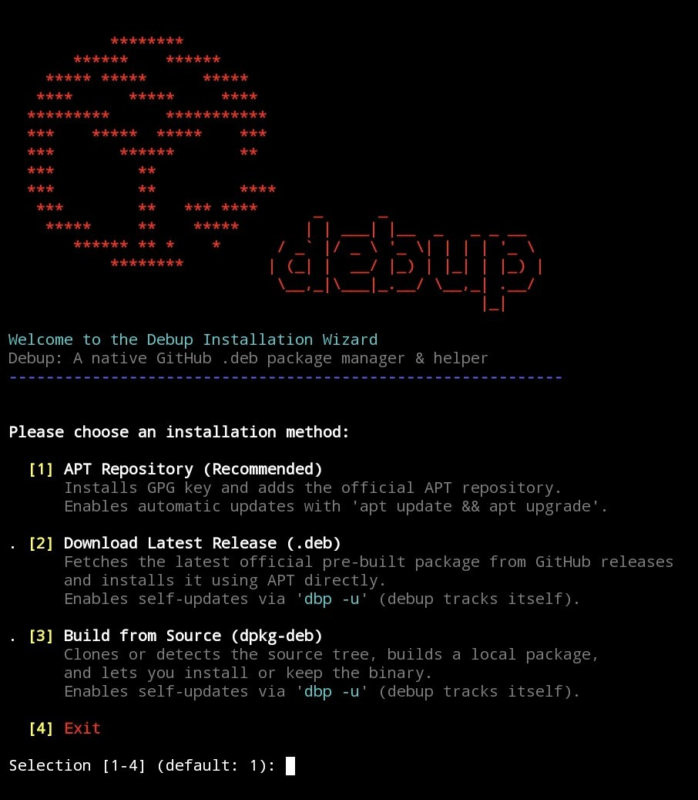

<div align="center">


<h1>debup</h1>
<p><strong>Le gestionnaire de paquets CLI façon AUR pour les distributions basées sur Debian/Ubuntu, Raspberry Pi, Docker, WSL et terminaux Linux Android (AVF, Proot debian/ubuntu).</strong></p>
<p>Recherchez, découvrez, suivez, installez et mettez à jour des paquets<code>.deb</code> directement depuis les GitHub Releases via <strong>APT</strong>.</p>
<p><em>Aucun PPA, aucune sandbox lourde, aucun dépôt tiers — uniquement des binaires <code>.deb</code> natifs récupérés directement en amont.
Installation simple avec le <a href="#option-1-dépôt-apt-recommandé">dépôt APT</a> ou l'<a href="#option-2-installation-rapide-en-une-ligne">installateur en une ligne</a>.</em></p>

</div>

<br/>

<div align="center">
<a href="LICENSE"></a> &nbsp;
<a href="https://debian.org"></a> &nbsp;
<a href="#"></a> &nbsp;
<a href="https://www.gnu.org/software/bash/"><imgsrc="https://img.shields.io/badge/Language-Bash-4EAA25.svg"alt="Bash"></a>
</div>

<div align="center">
<a href="https://github.com/Ruraam/debup/releases"></a> &nbsp;
<a href="#"></a> &nbsp;
<a href="https://github.com/Ruraam/debup/releases"></a>
</div>

<br/>

<div align="center">

<a href="README.md"> English</a> &nbsp;•&nbsp;
<a href="README.fr.md"> Français</a> &nbsp;•&nbsp;
<a href="README.es.md"> Español</a>

</div>

<div align="center">

| [Utilisation](https://github.com/Ruraam/debup/tree/main#%EF%B8%8F-usage) | [Jeton GitHub](https://github.com/Ruraam/debup/blob/main/README.md#-configure-a-github-token-optionnal--dbp-token-) | [Recherche & Installation](https://github.com/Ruraam/debup/tree/main#-discover-search--install-packages--dbp-search) | [Désinstallation](https://github.com/Ruraam/debup/tree/main#%EF%B8%8F-uninstallation) |
| :---: | :---: | :---: | :---: |
| [Configuration](https://github.com/Ruraam/debup/blob/main/README.md#%EF%B8%8F-configuration) | [Captures d'écran](https://github.com/Ruraam/debup/tree/main#screenshots) | [Journal des modifications](https://github.com/Ruraam/debup/releases) | [Licence](LICENSE) |
</div>

---

##  debup[ `dbp` ] - Le pont manquant entre GitHub et APT

La simplicité d'AUR vous manque sur Debian/Ubuntu ? **debup** transforme les GitHub Releases en votre dépôt tiers rolling-release personnel.
**Découvrez, inspectez, installez et mettez à jour des paquets Debian directement depuis les GitHub Releases avec la simplicité d'`apt`.**

## ✨ Fonctionnalités clés
🔍 **Découvrir** [`dbp -s <requête>`] :
* Trouvez des outils et applications directement sur GitHub sans quitter votre terminal, pré-filtrés pour les dépôts compatibles Debian/Ubuntu.
* Prend en charge le ciblage deversions spécifiques lors de la recherche et de l'inspection : récupérez et interrogez des tags précis directement via le point d'accès API GitHub `/releases/tags/...`.

📦 **Ajout direct**[`dbp -a <propriétaire/dépôt>`] :
* Plus besoin de chercher les URL de publication. Pointez vers n'importe quel dépôt, et debup détecte, associe votre architecture (`amd64` / `arm64`), télécharge et installe le bon paquet `.deb`.
* Prend en charge le verrouillage de version à l'installation : `dbp -a propriétaire/dépôt@vX.Y.Z`

ℹ️ **Inspecter** [`dbp -i <propriétaire/dépôt>`] :
* Prévisualisez les métadonnées avant de toucher à votre système (étoiles, licence, description, dernière version, compatibilité de l'architecture du paquet).

🔄 **Cyclede vie APT natif** :
* Installez, mettez à jour [`dbp -u `] et supprimez[`dbp -r`] vos paquets suivis de manière transparente grâce au moteur APT natif de votre système.

⚡ **Suivi d'API à haut débit** [`dbp -t`] :
* Stockez en toute sécurité un jeton d'accès GitHub personnel (`chmod 600`) pour débloquer 5 000 requêtes/heure pour les recherches intensives et les vérifications automatiques en arrière-plan.

**Complétion Bash native** :
* Prise en charge de l'autocomplétion pour la commande `debup` ainsi que l'alias `dbp`, avec suggestions dynamiques et contextuelles de paquets pour`remove`, `pin`, et `unpin`.

**🛡️ Épinglage de paquets** (`apt-mark hold`)
* **Geler les mises à jour :** Verrouillez des paquets spécifiques sur leur version actuelle via la commande `pin` (ou `hold`) pour empêcher les mises à jour non souhaitées.
* **Dégeler les mises à jour :**Restaurez les mises à jour automatiques à tout moment avec `unpin` (ou `unhold`).
* **Intégration APT native :** Repose directement sur le mécanisme standard `apt-mark` de Debian en arrière-plan, garantissant une cohérence à 100 % avec les outils natifs du système.

## 🎯 Détection intelligente des paquets

`debup` sélectionne automatiquement le bon binaire `.deb` depuis les GitHub Releases sans approximation :

***Architectures flexibles :** Prise en charge des noms standards et alias :
* **x86_64 :**`amd64`, `x86_64`, `x86-64`, `x64`, `all`
* **ARM64 :** `arm64`, `aarch64`,`armv8`, `arm64v8`, `all`
* **Protection inter-architectures :** Filtre activement les paquets incompatibles (ex. empêche le téléchargement d'un paquet `arm64` sur une machine `amd64`).
* **Priorisation par distribution :** Privilégie les builds spécifiques aux distributions (`debian` vs `ubuntu`) lorsque plusieurs paquets compatibles sont publiés.
* **Repli sécurisé :** Interruption propre avec un avertissement explicitesi aucun paquet compatible n'existe pour l'architecture de votre processeur.

---

## 📦 Installation
### ⚡ Installation Rapide Interactive / Non-Interactive
**Installateur Zero-Trust :** Intègre une validation stricte de l'empreinte GPG en fail-closed, un contrôle d'intégrité SHA-256, ainsi qu'un support complet pour l'installation interactive ou automatisée sans intervention (`-y` / CI/CD).

Lancez l'assistant d'installation interactif pour choisir votre méthode préférée (Dépôt APT,Dernière Release ou Compilation depuis les sources)
```bash
curl -sSL https://raw.githubusercontent.com/Ruraam/debup/main/install.sh | bash
```
&nbsp; 

Utilisez l'option `-y` pour une installation entièrement automatisée (installe le dépôt officiel APT par défaut sans intervention):
```bash
curl -sSL https://raw.githubusercontent.com/Ruraam/debup/main/install.sh | bash -s -- -y
```
<div align="center">



</div>

---

### 🔑 Configurer un jeton GitHub (optionnel) [ `dbp -t` ]

Par défaut, GitHub limite les requêtes anonymes à 60requêtes/heure. L'ajout d'un jeton augmente cette limite à 5 000 requêtes/heure.

**1. Générer un jeton :**

Rendez-vous sur GitHub > Settings > Developer settings > Personalaccess tokens > Tokens (classic) > Generate new token (aucune permission spécifique n'est requise, laissez tout décoché).

**2. Lier le jeton à debup :**
```bash
dbp -t
```
Collez votre jeton et confirmez. C'est tout !

`debup` le détectera et l'utilisera automatiquement, passant votre limite à 5 000 requêtes par heure.

> ***🔒 Note de sécurité :** Votre jeton est stocké de manière sécurisée dans `/etc/debup/debup.conf` avec des permissions restreintes (`chmod 600`), garantissant que seul root peut le lire.*

---

## 🛠️Utilisation

### Gestion des paquets
**Ajouter un dépôt pour installer le `.deb` et le suivre:**
```bash
dbp -a <propriétaire>/<dépôt>
```
par exemple : [ `dbp -a Ruraam/Uraam` ] 


**Lister les dépôts suivis **
```bash
dbp -l
```
**Supprimer un dépôt suivi**
```bash
dbp -r <nom-du-paquet>
```

**Empêcher la mise à jour d'une application**
```bash
dbp -p <nom-du-paquet>
```
**Autoriser à nouveau la mise à jour d'une application**
```bash
dbp -n <nom-du-paquet>
```
### Mises à jour des paquets
**Télécharger et mettre à jour les paquets suivis avec confirmation (avec & sans dépôt APT)**
```bash
dbp -u [-y]
```
**Mettre à jour debup via le dépôt APT :**
```bash
sudo apt update && sudo apt upgrade debup
```
### 🔍 Découvrir, rechercher et installer des paquets[ `dbp -s`]

Trouvez et découvrez tout projet GitHub fournissant des paquets .deb compatibles avec votre architecture et installez-les en un clic :

Rechercher des informations sur un dépôt :
```bash
dbp -i <propriétaire>/<dépôt>
```
##### Exemple : [ `dbp -i Ruraam/Uraam` ]
```bash
dbp -s <mot-clé>
```
##### Exemple : [ `dbp -s uraam` ]

**Fonctionnement:**

Entrez le numéro du paquet dans la liste et appuyez sur Entrée. debup télécharge lepaquet .deb correspondant, l'installe via apt et l'ajoute automatiquement à votre liste de suivi pour les futures mises à jour.

<p align="center">
  <imgsrc="/assets/debup_search3.png" width="200"></p>

---

## Raccourcis d'options CLI : drapeaux POSIX standard à lettre unique pour un flux de travail optimisé dansle terminal :

[-a|add : ajouter / installer] [-u|upgrade : mettre à jour / upgrade][-r|remove : supprimer] [-p|pin : figer / pin] [-n|unpin : débloquer / unpin] [-s|search : rechercher][-i|info : info / afficher] [-l|list : lister] [-t|token : jeton / auth]

>|
>**💡 Astuce :** Combinez les dépôts officiels et les releases GitHub en créant un alias `sudo apt update && sudo apt upgrade -y && dbp -u -y` dans votre `~/.bashrc`.
>|

---

## ⚙️ Configuration

**Les sources suivies sont stockées dans :** [ `/etc/debup/sources.list` ]

**Format :** [ `<nom-du-paquet>|<utilisateur-github>/<dépôt-github>` ]

**Lejeton GitHub est stocké dans :** [ `/etc/debup/debup.conf` ]

---

##🗑️ Désinstallation
**Supprimer le paquet**
```bash
dbp -r debup [-y]
```
Une confirmation vous demandera si vous souhaitez purger la configuration ou non.

ou
```bash
sudo apt remove debup[-y]
```
**Supprimer le paquet et nettoyer la configuration**
```bash
sudo apt --purge debup [-y]
```

---

## Captures d'écran
<p align="center">
   </p>

---

## 📄 Licence

Ce projet est sous licence [GNU General Public License v3.0](LICENSE).

---
> Comment installer des paquets .deb téléchargés depuis GitHub sur des systèmes basés sur Debian ou Ubuntu > > Comment mettre à jour automatiquement des paquets .deb téléchargés depuis GitHub sur des systèmes basés sur Debian ou Ubuntu
